## Wichtige Begriffe und Prozeduren für die Arbeit mit Github 

### Definitionen
Der richtige Branch links unten in der Ecke muss immer beachtet werden!!!
| Befehl | Erklärung | VSCode |
|--------|--------------| -------------|
| `pull` | Den aktuellen Stand eines Branches vom Repository auf Github in den lokalen Ordner ziehen | 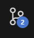 Source Control → Drei Punkte → Pull, dabei den richtigen Branch links unten in der Ecke beachten
| `add <Dateiname>` oder `add .` | Dateien, die im nächsten Schritt commitet und hochgeladen werden sollen, müssen erstmal zu einer sogenannten Staging-Area hinzugefügt werden. `add .` macht das mit allen editierten Dateien | Source Control → das + neben der Datei 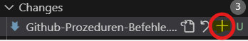 oder darüber (für alle Dateien) 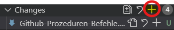|
| `commit` | Alle Dateien aus der Staging-Area für das Hochladen vorbereiten und dabei mit einer Nachricht ("Commit Message") versehen (Vorgang vergleichbar mit dem Blinker setzen vor dem Überholen oder dem Abbiegen beim Autofahren) | Source Control → 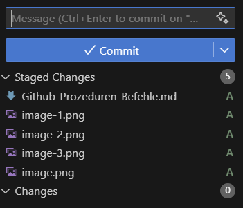 alle gestageden Changes werden in den Commit übernommen → Eingeben einer Nachricht → Drücke auf Commit. |
| `push` | Alle Dateien des letzten Commits oder der letzten Commits (Man kann auch nach mehreren Commits erst hochladen) werden auf das Remote-Repository in GitHub hochgeladen | Source Control → 2 Optionen: Separat Pushen: Source Control → Drei Punkte → Push, oder direkt im selben Step mit dem Committen hochladen: Dabei folgende Möglichkeiten: 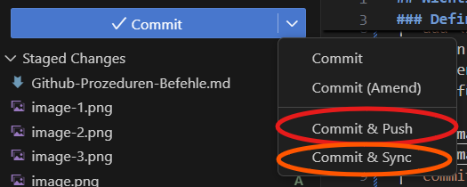 Hier ist zu beachten: 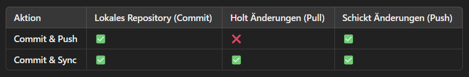 Das heißt, dass Commit & Sync einem das Pullen vor dem Hochladen erspart. Dabei sind jedoch folgende Konflikte zu beachten: 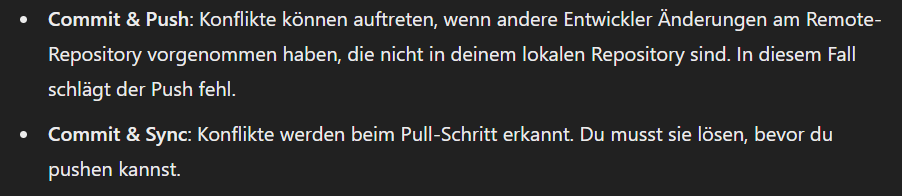 Beim separaten Pushen ohne vorher zu pullen verhält es sich an Konflikten wie beim `Commit & Push`. <span style="color:red"> Bei Konflikten, insbesondere größeren: Einmal Bescheid sagen. | 
| `stash` | Szenario: Du arbeitest gerade an einer Aufgabe, die aber noch nicht fertig ist und du möchtest sie noch nicht committen oder pushen. DU musst aber einmal auf einen anderen Branch um dir etwas anzuschauen. Dann kannst du Stash benutzen, was so viel bedeutet wie Zwischenspeichern. Dabei gibst du dem Stash eine Nachricht mit und über diese Nachricht kannst du den Stash wiederherstellen  | Source Control → Drei Punkte → Stash: 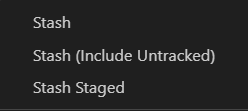: `Stash` (alle gespeicherten werden gestasht), `Stash Staged` (alle gestageden Dateien werden gestasht → Du kannst also auswählen welche du stashen möchtest und diese dann vorher stagen) → Nun nur noch message eingeben und schon werden sie zwischengespeichert und verschwinden vom Source Control;  Rückgängig machst du es, indem du entweder `Pop Latest Stash` (Letzter Stash) im selben Menü auswählst oder `Pop Stash` → und oben Stash message eingeben + Enter → Jetzt erscheinen die Dateien wieder so wie vorher im Source Control Tab.|
| `merge` | 1. Fall: Dein Branch ist hinter dem `develop`-Branch, das heißt nicht so aktuell wie der `develop`-Branch (Nachschauen auf GitHub → Code → Branches → 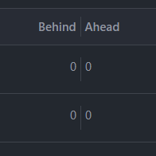 und die erste Zahl ist keine 0 in der Spalte deines Branches) oder du möchtest deine Änderungen auf den develop hochladen und diesen somit aktualisieren, dann brauchst du den Merge-Befehl  ///////////////////////////           2. Fall: du bist fertig mit deiner Aufgabe/deinem Issue und möchtest in den develop mergen, damit alle deinen Stand bekommen | 1.Fall: Zuerst alle Änderungen hochladen auf deinem Branch, evtl. Konflikte lösen, dann den Branch links unten in der Ecke wechseln → `develop` auswählen →  ZUERST PULLEN damit du den neusten Stand auch lokal hast!, jetzt den Branch wieder auf deinen Branch zurückwechseln (links unten in der Ecke auf `develop` drücken und dann im Dropdown deinen wählen), dann auf Source Control → Drei Punkte → Branch → Merge... → `develop` auswählen und warten bis der Ladebalken fertig ist ////////////////////////// 2. Fall: Zuerst alle Änderungen hochladen auf deinem Branch, evtl. Konflikte lösen. In unserem Falle ist der Branch `develop` geschützt, dh. es muss jetzt ein Pull Request erstellt werden (Siehe: Prozeduren → Änderungen mit einem Pull Request in einen geschützten Branch (develop) mergen)
### Wichtige GitHub Befehle

#### Konfiguration
| Befehl | Beschreibung |
|--------|--------------|
| `git config --global user.name "Dein Name"` | Git Benutzername konfigurieren |
| `git config --global user.email "deine.email@example.com"` | Git E-Mail konfigurieren |

#### Repository in der Kommandozeile erstellen oder clonen
| Befehl | Beschreibung |
|--------|--------------|
| `git init` | Neues lokales Repository erstellen im eigenen Filesystem. Ist aber noch nicht auf GitHub zu sehen! |
| `git clone <repository-url>` | Bestehendes Repository klonen, `<repository-url>` ist auf dem Repo in GitHub unter dem Reiter `Code` in der Menübar → Button  zu finden: 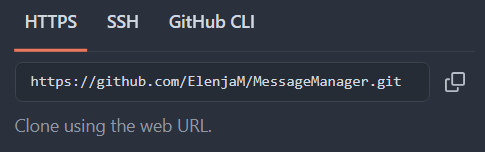 |
| `git status` | Status der Änderungen anzeigen |

#### Den neusten Stand vom Repo in GitHub ziehen/herunterladen 

<span style="color:red">GANZ WICHTIG: Dies muss immer vor dem Hochladen gemacht werden, besonders wenn auch andere auf dem Branch mitarbeiten. Der develop sollte regelmäßig gepullt werden um den aktuellsten Stand zu erhalten. </span>
| Befehl | Beschreibung |
|--------|--------------|
| `git pull` oder `git pull origin <branch-name>` | Änderungen vom vorausgewählten Branch oder vom spezifizierten Branch (`<branch-name>`) ziehen/ herunterladen |

#### Den lokalen Stand/ eigene Dateien hochladen 
| Befehl | Beschreibung |
|--------|--------------|
| `git add <dateiname>` oder `git add .` | Datei oder alle editierten Dateien zur Staging-Area hinzufügen |
| `git commit -m "Commit Nachricht"` | Änderungen committen |
| `git push` oder `git push origin <branch-name>` | Änderungen auf den vorausgewählten oder spezifizierten (`<branch-name>`) Branch des Remote-Repositorys pushen/ hochladen |

#### Branch erstellen/ wechseln/ löschen
| Befehl | Beschreibung |
|--------|--------------|
| `git branch <branch-name>` | Neuen Branch erstellen, bitte aber immer in Github über das Issue erstellen (Issue → rechte Seite unter Asignees, ... → `Create a branch`, Sourcebranch ist per default der `develop`) → In VSC laden: Schau im Kapitel <span style="font-weight:bold;">Prozeduren</span> unter <span style="font-weight:bold;">Den Branch in VSCode laden</span>   |
| `git checkout <branch-name>` | Zu einem Branch wechseln → Einfacher: in VSC links unten in der Ecke auf den zurzeitigen Branch klicken → im Auswahlfeld den gewünschten Branch wählen. Beachte: Es müssen alle Änderungen vom zurzeitigen Branch entweder committet oder gestasht sein, sonst funktioniert es nicht!|
| `git checkout -b <branch-name>` | Branch erstellen und wechseln |
| `git branch -d <branch-name>` | Branch löschen; Bitte auch in GitHub machen. GitHub → Code → Branches → Papierkorb-Icon in der Spalte des `<branch-name>` auswählen → In VSC: Synchronisierungsicon neben dem `<branch-name>` links unten auswählen  und zu einem anderen Branch wechseln |

#### Stashen
| Befehl | Beschreibung | Verwendung |
|--------|--------------|------------|
| `git stash` | Git Stash erstellen | Speichert uncommittete Änderungen temporär, um an einem sauberen Arbeitsverzeichnis weiterzuarbeiten. Nützlich, wenn man schnell den Branch wechseln muss. In VSC: siehe Definitionen → `stash`  |
| `git stash apply` | Git Stash anwenden | Wendet die zuletzt gespeicherten Änderungen aus dem Stash auf das aktuelle Arbeitsverzeichnis an. |

#### Git History prüfen (Commits etc.)
| Befehl | Beschreibung | Verwendung |
|--------|--------------|------------|
| `git log` | Git Log anzeigen | Zeigt eine Liste aller Commits im Repository an, einschließlich der Commit-Hashes (Commit-IDs), Autorennamen, Daten und Commit-Nachrichten. Nützlich, um die Historie der Änderungen nachzuverfolgen und bei der Fehlersuche. |
| `git diff` | Git Diff anzeigen | Zeigt die Unterschiede zwischen dem aktuellen Arbeitsverzeichnis und dem letzten Commit an. Nützlich, um Änderungen vor dem Staging oder Commit zu überprüfen. |

#### Hilfe
| Befehl | Beschreibung | Verwendung |
|--------|--------------|------------|
| `git help <befehl>` | Hilfe zu einem Befehl anzeigen | Zeigt die Dokumentation und Hilfe zu einem bestimmten Git-Befehl an. |

#### Habe ich selbst noch nie benutzt:
| Befehl | Beschreibung | Verwendung |
|--------|--------------|------------|
| `git remote add origin <repository-url>` | Remote-Repository hinzufügen | Wird verwendet, um ein Remote-Repository zu einem lokalen Repository hinzuzufügen, damit Änderungen gepusht und gepullt werden können. Macht man einfach direkt in Github. |
| `git remote -v` | Liste der Remote-Repositories anzeigen | Zeigt die URLs der Remote-Repositories an, die mit dem lokalen Repository verbunden sind. Schaut man sich in GitHub an.|
| `git remote remove <name>` | Remote-Repository entfernen | Entfernt ein Remote-Repository aus der Liste der Remote-Repositories. Macht man auch in GitHub |
| `git tag <tag-name>` | Neuen Tag erstellen | Erstellt einen neuen Tag, der einen bestimmten Punkt in der Commit-Historie markiert, oft für Releases verwendet. |
| `git push origin <tag-name>` | Tag zu Remote pushen | Pusht einen lokalen Tag zu einem Remote-Repository, um ihn dort verfügbar zu machen. |
| `git tag -d <tag-name>` | Tag löschen | Löscht einen lokalen Tag. |


## Prozeduren

### Zwischen Projektplan und Repo wechseln 
- Von Repo auf Projektplan: 
  Oben in der Menübar Projects anwählen → Jeweiliges/n Projekt(-plan) anwählen
- Von Projektplan auf Repo:
   - 2 x `Zurück` über den Browser anwählen oder 
   - Das Repository vorher mit einem Stern markieren (oben rechts   
     neben der Menübar 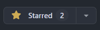), 
     Auf den Plan gehen → auf dein Profilfoto klicken → 
     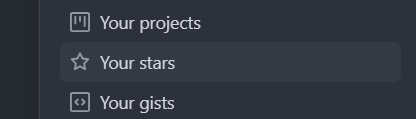 `Your stars` anwählen → Repo wählen
    - Falls alle Stricke reißen: Über die Einladung aus der         
      Mail/Link im Discord auf das Repo gelangen, jetzt mit Stern 
      markieren
### Ein Issue in GitHub erstellen
#### Issue über das Repository erstellen
1. Gehe zu deinem Repository auf GitHub.
2. Klicke auf den Reiter "Issues".
3. Klicke auf die Schaltfläche "New issue".
4. Gib einen Titel und eine Beschreibung für das Issue ein. Der Titel sollte immer eine Handlung beinhalten (Zb. Create Dashboard) In die Beschreibung müssen die Akzeptanzkriterien als abzuhakende Liste und können Bilder, Links, Quellen, etc. kopiert werden um verständlicher zu machen, was hier gemacht werden soll. 
5. Wähle auf der rechten Seite einen Bearbeiter (Asignee) aus, falls schon festgelegt wurde, wer dieses Issue bearbeiten soll. Du kannst es auch dir selbst zuweisen.
6. Optional: Wähle ein Label aus (direkt unter Asignee). Falls keiner passt, kannst du auch einen erstellen. Beispiel: 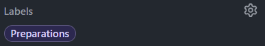 
7. Wähle das Projekt aus. Dann wird das Issue auch im Projektplan angezeigt und kann dort getrackt werden.
9. Wähle einen passenden Meilenstein aus. (Selbst die Frage stellen: Zu welchem Zeitpunkt sollte das Issue erledigt sein? Unter welchen Punkt passt es am besten?)
10. Klicke auf "Submit new issue".
11. Gehe auf den Projektplan und wähle deine erstelltes Issue aus. Dafür musst du wahrscheinlich den Filter nach der `current Iteration` aus
12. Weise dem Issue die in der rechten Spalte unter `Iteration` die korrekte Iteration zu. Die Iterationen sind den Meilensteinen angepasst. Es muss also die Iteration ausgewählt werden, die auf den Zeitraum des Meilensteins passt.
13. Ziehe das Issue in die passende Statusspalte.

#### Issue über den Projektplan erstellen 
1. Wähle unter dem Reiter <span style="font-weight:bold;">Projects</span> das entsprechende Projekt aus. 
2. Wähle das `+ Add item` unterhalb einer Statusspalte an. In dieser Spalte wird das Issue dann auch auftauchen.
3. Gebe dem Issue einen geeigneten Titel. Der Titel sollte immer eine Handlung beinhalten (Zb. Create Dashboard) und wähle dann `Create new Issue` aus. 
4. Wähle nun das Repo aus, zu dem das Issue gehört und danach `Blank Issue`. 
5. Schreibe die AKzeptanzkriterien als `Task Liste` in die Beschreibung. Das funktioniert mit folgendem Button in der oberen Spalte auf der rechten Seite: 
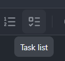
Du kannst auch weitere Informationen, Bilder, Screenshots, etc. hinzufügen
6. Nun klicke auf den grünen Button `Create`.
7. Finde dein Issue auf dem Projektplan. Evtl. musst du den Filter in der Suchleiste entfernen:
8. Weise nun die rot umrandeten Felder zu.
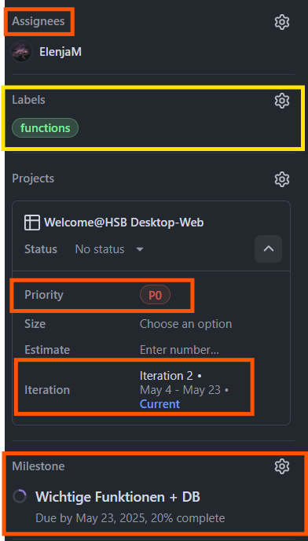 Assignees kann erstmal weggelassen werden, <span style="font-weight:bold;">muss aber bei Bearbeitung zugewiesen werden.</span>. Labels ist optional. 
9. Jetzt kann das Issue oben rechts in der Ecke geschlossen werden und in die `Backlog` oder `Ready`/ `TODO` Spalte gezogen werden. Wenn du es direkt bearbeiten möchtest, weise es dir zu, erstelle den Branch (siehe nächster Abschnitt) und ziehe es in die `In Progress`- Spalte.

### Einen Branch aus einem Issue erstellen
1. Gehe zu dem erstellten Issue.
2. Klicke auf die Schaltfläche "Create a branch" auf der rechten Seite relativ weit unten.
3. Belasse den Namen beim vorausgewählten, dieser stellt die Verbindung zum zugehörigen Issue her.
4. OPTIONAL: Du kannst den Source-Branch wechseln, wenn du einen anderen Branch als Grundlage haben möchtest, der aber zB. noch nicht im develop gemerged ist, weil du noch auf die Erlaubnis zum mergen in den develop vom Reviewer wartest: Dafür auf `Change Source Branch` (relativ klein geschrieben neben `Repository Destination`) klicken und einen anderen Branch im Dropdown Menü auswählen.
5. Klicke auf "Create branch".

### Den Branch in VSCode laden und weiterarbeiten
Option 1:
1. Öffne VSCode.
2. Öffne das lokale Verzeichnis in welchem du das Repo geclont hast.
3. Gegebenefalls Terminal öffnen: (`Strg + Shift + Ö`) und sicherstellen, dass du im richtigen Verzeichnis bist. Powershell:
    ```bash
    PS /path/to/your/repository
    ```
4. Wähle das Synchronisierungsicon neben dem`<branch-name>` links unten neben dem Terminal aus und synchronisiere mit dem GitHub Repo 
5.  Wähle den `<branch-name>` links unten neben dem Terminal aus (siehe Bild in Punkt 4), der dir dort angezeigt wird, aus und wähle dann im Dropdown-Menü den neuen Branch aus.
6. Wenn dieser noch nicht angezeigt wird: Wähle Source Control → Drei Punkte → Fetch. Jetzt Schritt 5 wiederholen.

Option 2: 
1. Öffne VSCode.
2. Öffne das lokale Verzeichnis in welchem du das Repo geclont hast.
3. Gegebenefalls Terminal öffnen: (`Strg + Shift + Ö`) und sicherstellen, dass du im richtigen Verzeichnis bist. Powershell:
    ```bash
    PS /path/to/your/repository
    ```
4. Gehe zum Source Control Tab (Symbol mit drei verbundenen Punkten auf der linken Seitenleiste).
5. Klicke auf die drei Punkte oben im Source Control Tab.
6. Wähle "Pull" aus dem Dropdown-Menü, um die neuesten Änderungen vom Remote-Repository zu ziehen.
7. Klicke erneut auf die drei Punkte oben im Source Control Tab.
8. Wähle "Branch" und dann "Checkout to..." aus dem Dropdown-Menü.
7. Wähle den neuen Branch (`origin/feature/issue-nummer`) aus.
8. Arbeite an deinen Änderungen in VSCode.


### Änderungen committen und pushen
1. Zu aller erst immer den aktuellen Stand von GitHub pullen, besonders wenn du mit anderen auf dem Branch arbeitest: 
2. Füge die geänderten Dateien zur Staging-Area hinzu:
    - Gehe zum Source Control Tab.
    - Klicke auf das Plus-Symbol (+) neben den Dateien, die du zur Staging-Area hinzufügen möchtest. Um alle Dateien hinzuzufügen, klicke auf das Plus-Symbol (+) neben dem Begriff `Changes` (sieht man wenn man drüber hovert).

3. Committe die Änderungen mit einer Nachricht:
    - Gib eine Commit-Nachricht in das Textfeld oben ein.
    - Klicke auf das `Commit` mit Häkchen-Symbol (✓) oben im Source Control Tab, um die Änderungen zu committen.
    - Falls `Commit & Sync` oder `Commit & Push` vorausgewählt sind, kannst du das auch benutzen und brauchst Schritt 4 nicht mehr ausführen: Der Unterschied zwischen separaten Pushen und `Commit & Sync`, `Commit & Push` wird unter <span style="font-weight: bold"> Definitionen</span> → `push` erklärt.
    - Du kannst als Standardauswahl der Aktion des blauen Buttons zwischen `Commit`, `Commit & Sync` oder `Commit & Push` auswählen. <span style="color: red">Solltest du dich für `Commit` oder `Commit & Push` musst du zwingend Schritt 1 einhalten!</span> <span style="font-weight: bold">Grundsatz: Lieber einmal zu viel als einmal zu wenig Pullen.</span>

4. Pushe die Änderungen zum Remote-Repository:
    - Klicke auf die drei Punkte oben im Source Control Tab.
    - Wähle "Push" aus dem Dropdown-Menü, um die       
      Änderungen zum Remote-Repository zu pushen.
5. Falls Konflikte entstehen, bitte Bescheid geben!
### Änderungen mit einem Pull Request in einen geschützten Branch (develop) mergen
1. Gehe zu deinem Repository auf GitHub.
2. Klicke auf den Reiter "Pull requests".
3. Klicke auf die Schaltfläche "New pull request".
4. Wähle den Basis-Branch (`develop`) und den Vergleichs-Branch = dein Branch der Form `nummer-issuename` aus.
5. Klicke auf "Create pull request".
6. Gib einen Titel und eine Beschreibung für den Pull Request ein.
7. Wähle einen Reviewer und Asignee aus (Asignee kannst wieder du sein)
8. Wähle das Projekt und den gleichen Meilenstein wie das Issue an (falls möglich)
9. Klicke auf "Create pull request".
10. Warte auf die Überprüfung und Genehmigung durch einen Reviewer.
11. Sobald der Pull Request genehmigt ist, klicke auf "Merge pull request".
12. Lösche den Branch, wenn er nicht mehr benötigt wird. (Code → Branches → Papierkorb-Icon) 
13. Ziehe dein Issue in die Spalte `DONE` auf dem Board des Projektplanes und wähle deine nächste Aufgabe (Siehe <span style="font-weight: bold"> Prozeduren → Einen Branch aus einem Issue erstellen </span>, du kannst hier direkt eins aus der Spalte `TODO` wählen. Für neue Issues: zuerst <span style="font-weight: bold"> Prozeduren → Ein Issue in GitHub erstellen. </span> befolgen)

### Hilfe, ich wurde einem Pull Request als Reviewer zugewiesen, was tun?

1. Gehe zu deinem Repository auf GitHub.
2. Klicke auf den Reiter "Pull requests".
3. Finde den Pull Request, den du überprüfen  möchtest, und klicke darauf.
4. Überprüfe die Änderungen, die im Pull Request vorgeschlagen wurden. Du kannst dies tun, indem du auf die Tabs "Files changed" und "Conversation" schaust.
5. Wenn du mit den Änderungen einverstanden bist, klicke oben rechts auf die Schaltfläche "Review changes".
6. Wähle "Approve" aus den Optionen.
7. Gib optional einen Kommentar ein, um dein Approval zu erklären.
8. Klicke auf "Submit review".
9. Sage dem Pull-Request-Ersteller Bescheid, das beschleunigt den Prozess des Mergens (Hilfe zum Mergen? Schau dir den Punkt hier drüber "Änderungen mit einem Pull Request in einen geschützten Branch (develop) mergen" an)

### Zusammenfassung
Diese Anleitungen beschreiben, wie man ein Issue in GitHub erstellt, daraus einen Branch erstellt, diesen in VSCode lädt und daran weiterarbeitet. Außerdem wird erklärt, wie man Änderungen pusht und bei einem geschützten Branch (develop) Änderungen mit einem Pull Request merged, den ein Reviewer zuerst genehmigen muss.